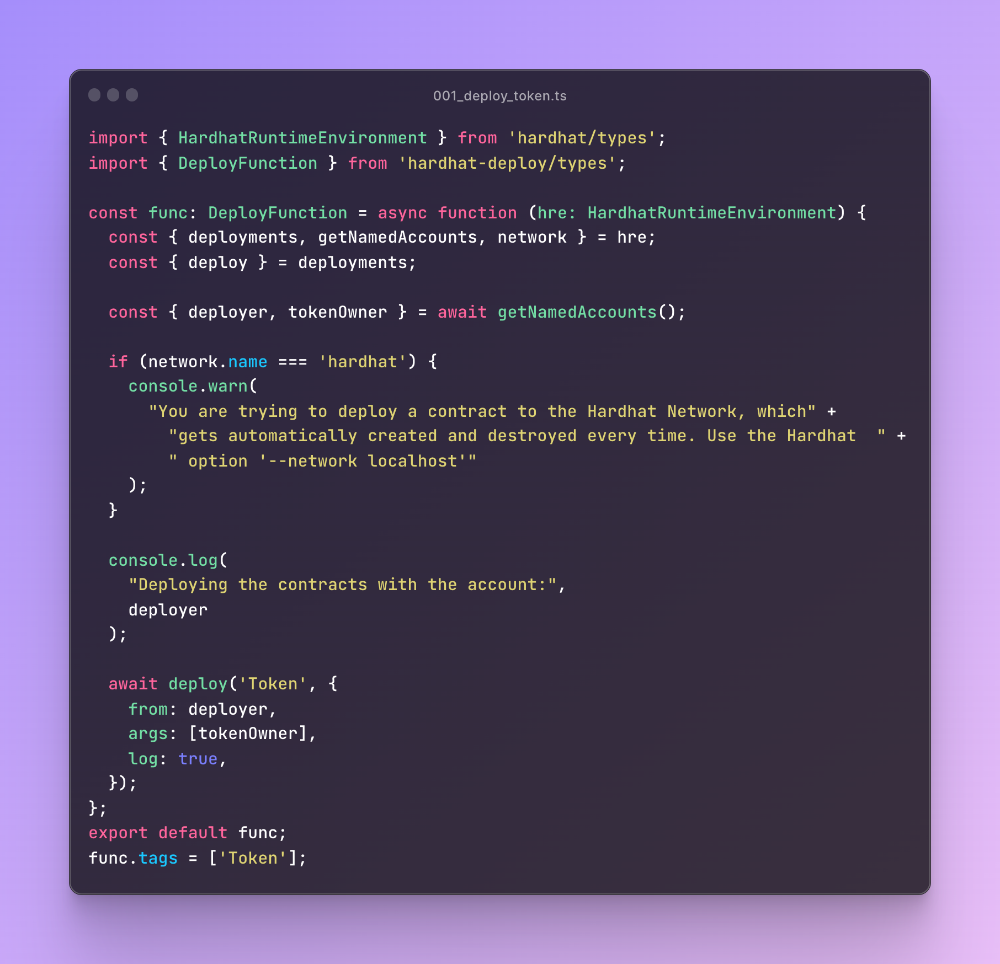
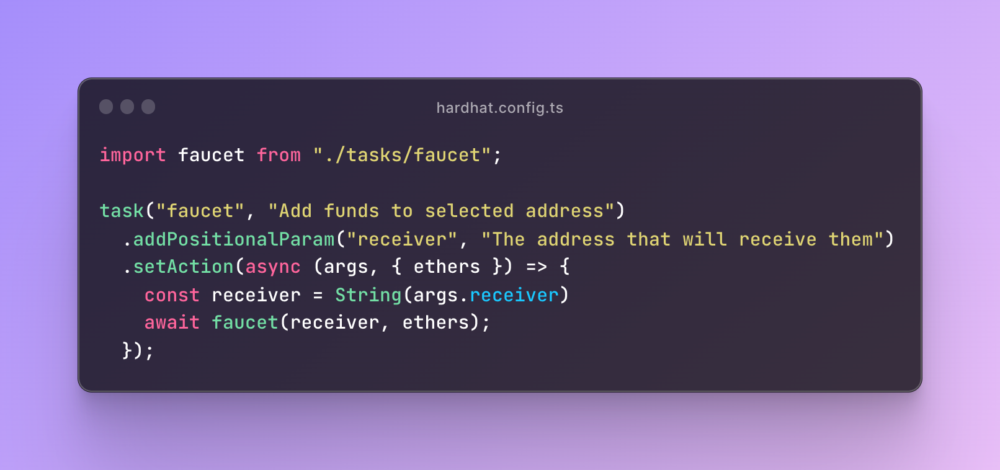

# Customizing the boilerplate
This boilerplate can be divided in two parts, the Smart contract logic (Writing the smart contract, deploying it and running tasks), and the Frontend project (the way the final user will interact with the smart contract).

Let's checkout how to customize each of those:

## Smart Contracts
To customize the boilerplate, you must check a few files and folders.
You can start by checking the `contracts` folder on the projects base directory.

Each contract should include a deployment function located inside the `deploy` folder. Let's check the `001_deploy_token.ts` file:



The deploy function receives as a parameter a `HardhatRuntimeEnvironment`, which comes in handy for accessing things like the network you’re deploying to, and the named accounts (specified on hardhat.config.ts). You can check hardhat’s documentation on the `HardhatRuntimeEnvironment` [here](https://hardhat.org/hardhat-runner/docs/advanced/hardhat-runtime-environment).

In the tasks folder, you can create tasks that will be run by hardhat. You can check `tasks/faucet.ts` which is a simple task that transfers 1 ETH & 100 Tokens to an ethereum address. You might create a task to reset the state of a development environment, or to interact with your contracts, or to package your project.

You’ll also need to add the task to the hardhat.config.ts like this:



You can now run the faucet task on localhost by running the following command:
```
pnpm hardhat faucet <your-address> --network localhost
```

## Frontend


Now let’s move on to the Frontend located inside the `frontend` folder. As explained in the previous section, it uses NextJs as the framework of choice. You can check [Nextjs documentation](https://nextjs.org/docs/getting-started) for further details.

Inside `pages/_app.tsx` you can check the configuration for `wagmi` and `RainbowKit`. You should also check the `Dap`p component, located inside the `components` folder. This component contains the default business logic to implement a simple transfer.

You can use it as a reference for understanding how the `useSendTransactio`n and `usePrepareSendTransaction` wagmi hooks work, making it super easy to interact with your contracts. You can check wagmi’s documentation [here](https://wagmi.sh/).

For handling the wallet connection, I added RainbowKit’s `ConnectButton` component inside the `NavBar.tsx` file.

And that’s it! By following these steps, you should understand the boilerplate’s architecture and which files can be modified to start developing your new project.
